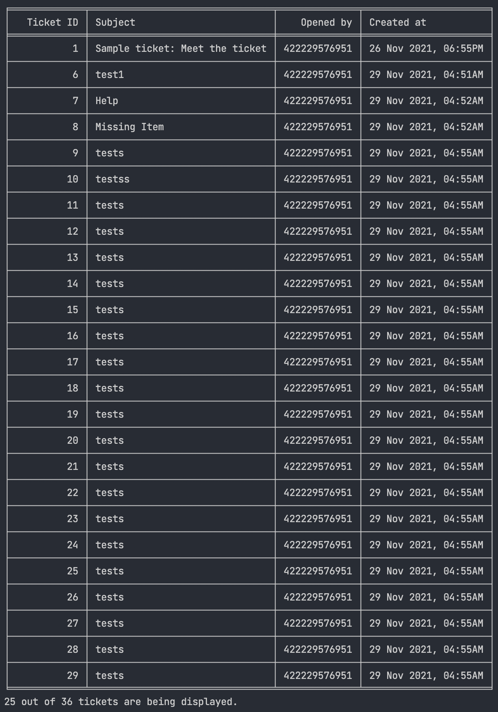

# Simple Ticket Viewer (CLI)
The ticket_viewer.py is the script that runs the ticket viewer app.

I chose to do a CLI based program.

# Installation Guide
This program runs on Python 3 and higher. 
The following python modules have to be installed:
requests, tabulate and pyfiglet

These modules could be downloaded by the commands below:

```pip3 install requests```

```pip3 install tabulate```

```pip3 install pyfiglet```

In order to run the program successfully, the following 
environment variables should be set as well:
SUBDOMAIN, USER_EMAIL and PASSWORD.

SUBDOMAIN is your zendesk subdomain

USER_EMAIL is your account's email address

PASSWORD is your account's login password.

# Program details
The program has the option to display either all the tickets 
or a specific one. The user will be greeted with a menu that lists
out those options. If the user selects the option to display
all the tickets, the following output will be produced:



If the user selects the option to display a single ticket,
more specific information about that ticket will be printed
in a more user-readable format, including the description of
that ticket.

The program will print out error messages if the API is not 
responding or there are issues with authentication. Inputs 
are case-sensitive and the program will ask for the input again
if the input is not found.